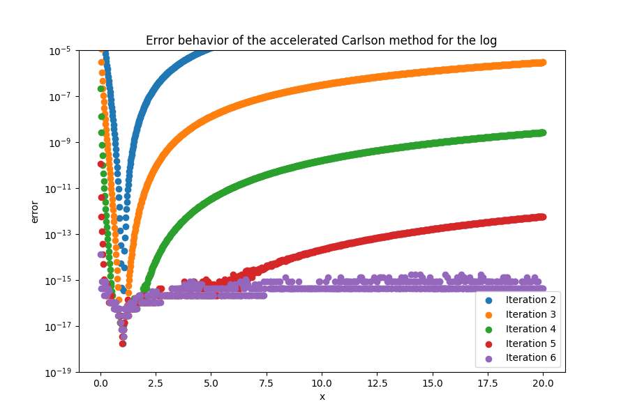
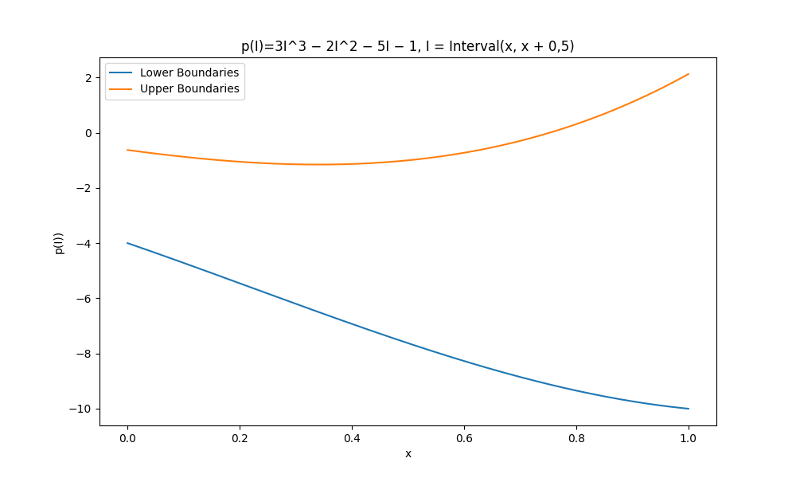

# Computational Programming with Python

## Final project: Sparse Matrices

Sparse matrices are matrices with a large amount of zeros. For matrices with very large dimensions (shape), storing all its elements - even the zeros - might not be feasible due to memory constraints. Moreover, certain linear algebra operations (e.g. matrix multiplication) can be significantly accelerated by avoiding the multitude of multiplications with zero.

Handling sparse matrices necessitates two interrelated steps:

1. **Data Storage**: Organize the data storage effectively to ensure fast data access and minimized storage.
2. **Algorithm Development**: Develop algorithms for linear algebra operations that take advantage of this data organization.

Occasionally, conversion algorithms might also be required.

For a quick reference on different sparse matrix representations, please visit the [Wikipedia page on Sparse Matrices](http://en.wikipedia.org/wiki/Sparse_matrix).

## Homework 1: Approximating the Logarithm Function

In this homework, we will approximate the log-function using an iterative method. With each iteration, the result is improved. The iteration method is based on the algorithm described in:

> B. C. Carlsson: "An Algorithm for Computing Logarithms and Arctangents," Math-Comp. 26 (118), 1972, pp. 543-549.

The algorithm is based on computing the arithmetic and geometric mean of two values, `ai` and `gi`.

### The Algorithm

For a given value `x > 0`, initialize:

- `a0 = (1+x) / 2`
- `g0 = √x`

And then iterate as follows:

- `ai+1 = (ai + gi) / 2`
- `gi+1 = √(ai+1 * gi)`

The approximation to `ln(x)` can then be considered as `x-1 / ai`.

## Homework 2: Interval analysis

